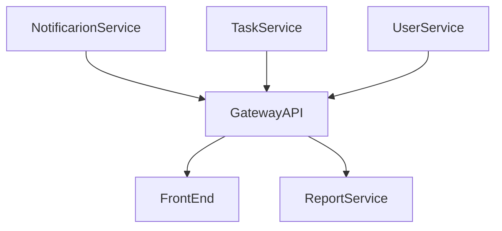

# 1. Visão Geral da Arquitetura

A arquitetura da Plataforma de Gestão de Tarefas é baseada em uma abordagem de microserviços para garantir escalabilidade, flexibilidade e manutenção eficiente. O sistema é composto por vários serviços independentes que se comunicam através de APIs e são orquestrados usando Docker e Docker Compose.

# 2. Componentes Principais

## 2.1. Microserviços

### Task Service 
**Responsabilidade:** Gerencia todas as operações relacionadas a tarefas, incluindo criação, atualização, e listagem de tarefas. 
**Tecnologias:** PHP, MariaDB 

Endpoints Principais:

    POST /tasks: Criar nova tarefa
    GET /tasks/{id}: Obter detalhes de uma tarefa
    PUT /tasks/{id}: Atualizar tarefa
    DELETE /tasks/{id}: Excluir tarefa

### User Service 
**Responsabilidade:** Gerencia usuários e autenticação, incluindo registro, login e gerenciamento de perfis. 
**Tecnologias:** PHP, MariaDB 

Endpoints Principais:

        POST /users/register: Registrar novo usuário
        POST /users/login: Autenticar usuário
        GET /users/{id}: Obter detalhes do usuário
        PUT /users/{id}: Atualizar perfil do usuário

### Notification Service 
**Responsabilidade:** Envia notificações para os usuários sobre eventos importantes, como novas tarefas ou atualizações. 
**Tecnologias:** PHP, MariaDB 
    
Endpoints Principais:

        POST /notifications/send: Enviar notificação
        GET /notifications/{id}: Obter notificação específica

### Report Service 

**Responsabilidade:** Gera e fornece relatórios sobre o uso do sistema, estatísticas de tarefas e outros dados relevantes. 
**Tecnologias:** PHP, MariaDB 
    
Endpoints Principais:

        GET /reports/tasks: Obter relatório de tarefas
        GET /reports/users: Obter relatório de usuários

## 2.2. Front-End

**Responsabilidade:** Interface de usuário interativa e responsiva, desenvolvida com Angular. 

**Tecnologias:** Angular 

**Funcionalidades:** 
    Painel de controle de tarefas 
    Perfil de usuário e configurações 
    Visualização de relatórios 

## 2.3. Banco de Dados

**Banco de Dados:** MariaDB 

**Responsabilidade:** Armazenar dados de tarefas, usuários e notificações de forma eficiente. 

**Estrutura:** 
    Tasks: Tabela para armazenar informações de tarefas. 
    Users: Tabela para armazenar informações de usuários. 
    Notifications: Tabela para armazenar notificações enviadas. 

## 2.4. Orquestração e Containerização

**Docker Compose:** Utilizado para definir e gerenciar a configuração de múltiplos containers. 
**Containers:** 
    Task Service Container 
    User Service Container 
    Notification Service Container 
    Report Service Container 
    Front-End Container 

# 3. Diagramas de Arquitetura

# 3.1. Diagrama de Arquitetura de Microserviços

# 4. Estratégia de Segurança

**Autenticação e Autorização:** Utilização de tokens JWT para autenticação e controle de acesso. 
**Proteção de Dados:** Criptografia de dados sensíveis e utilização de conexões seguras (HTTPS). 
**Monitoramento e Logs:** Implementação de ferramentas de monitoramento para identificar e responder a eventos de segurança. 

# 5. Estratégia de Deploy

**Ambiente de Desenvolvimento:** Containers Docker configurados e gerenciados localmente. 
**Ambiente de Produção:** Deploy em servidores com suporte a Docker, configurados para alta disponibilidade e escalabilidade. 
